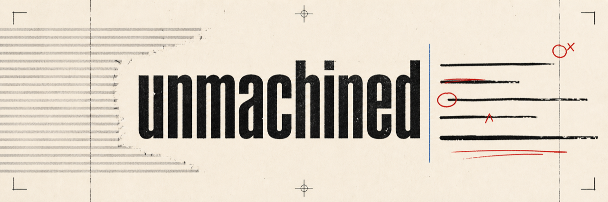
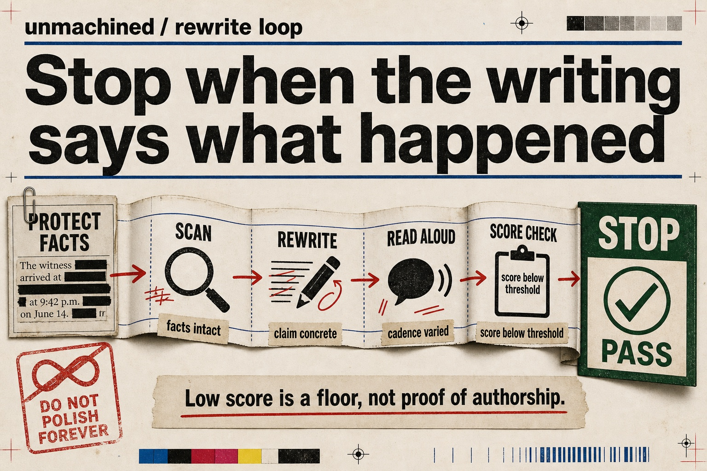
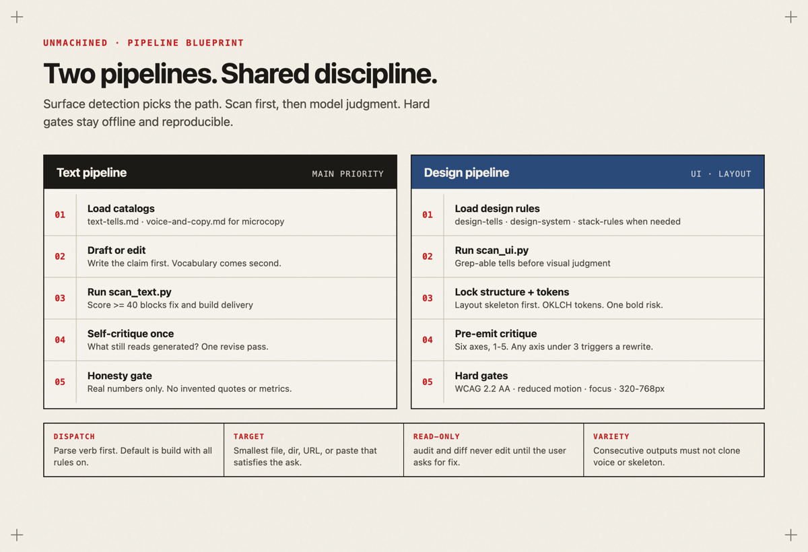
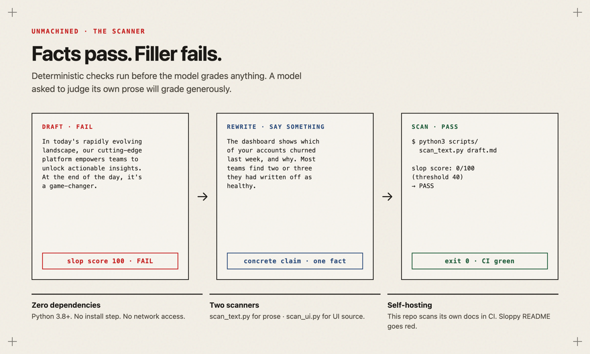
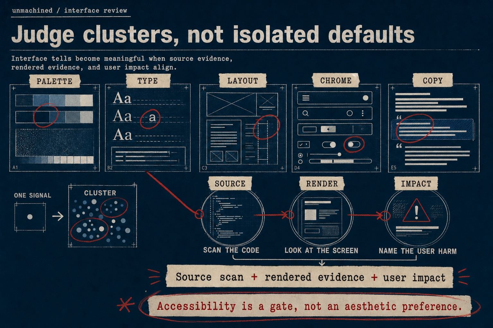
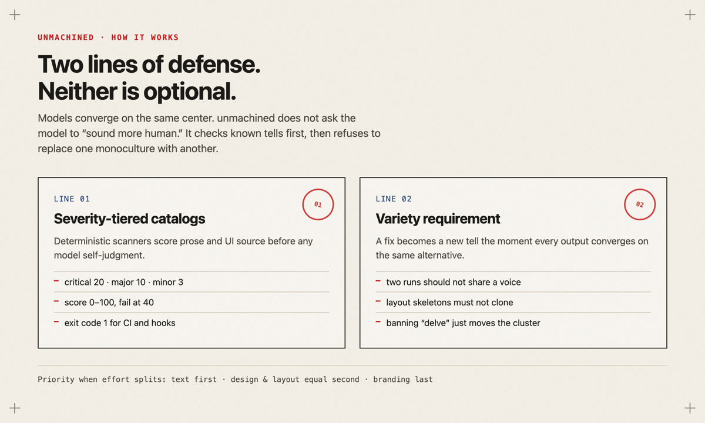
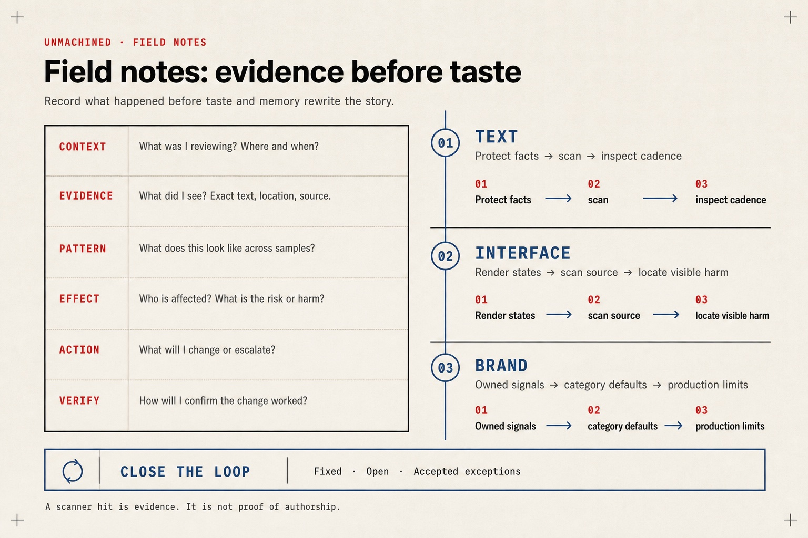
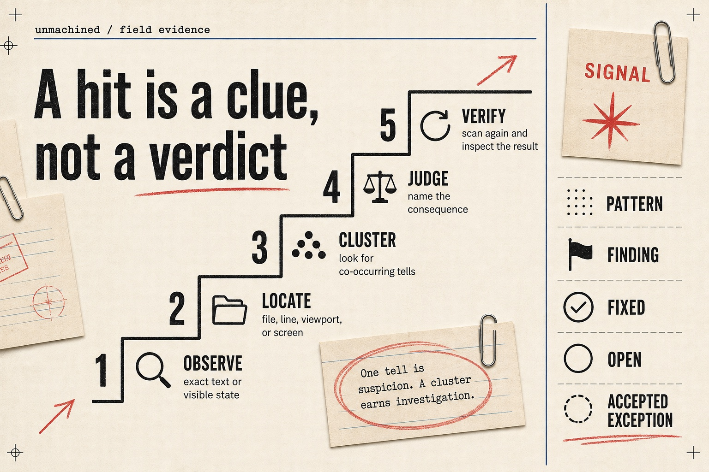
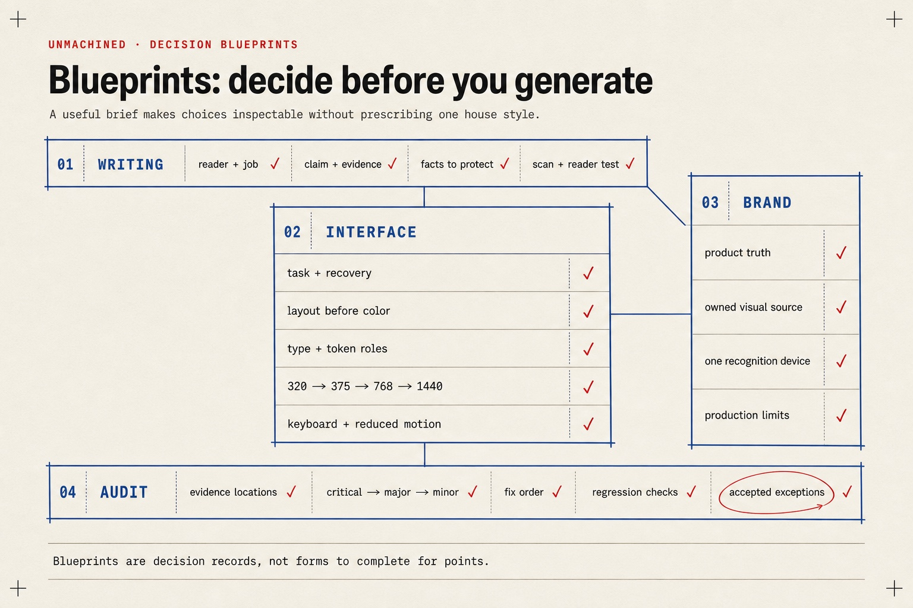
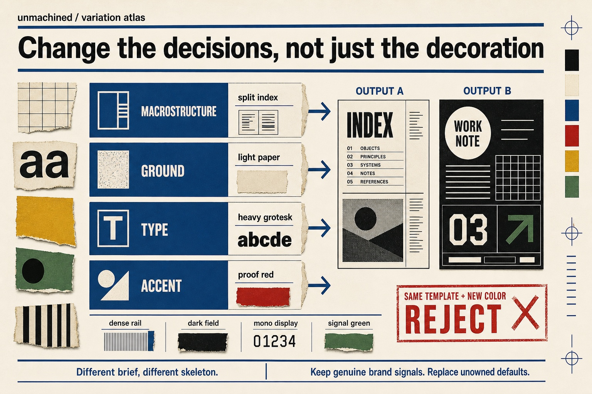

# unmachined

An agent skill that removes familiar AI tells from writing and interface work.

[](https://github.com/0xNyk/unmachined/actions/workflows/ci.yml)
[](LICENSE)

unmachined combines deterministic scanners with editing rules for prose, layout,
design systems, and brand work. It catches known patterns, then asks for evidence and
variation so the repair does not become another house style.

## Try the text scanner

The scanners require Python 3.8 or newer. They have no runtime dependencies and make no
network requests.

```bash
git clone https://github.com/0xNyk/unmachined.git
cd unmachined
printf '%s\n' "In today's evolving landscape, our cutting-edge platform is a game-changer." \
  > /tmp/unmachined-draft.md
python3 scripts/scan_text.py /tmp/unmachined-draft.md
```

The command exits with status 1 because the draft crosses the default score threshold of
40. Each finding includes its severity, location, rule, and source excerpt. Rewrite the
claim with facts, run the same command again, and treat a passing scan as a floor rather
than proof that a person wrote it.

```bash
printf '%s\n' 'The report lists accounts that canceled last week and the reason each customer gave.' \
  > /tmp/unmachined-draft.md
python3 scripts/scan_text.py /tmp/unmachined-draft.md
```

Expected final line:

```text
slop score: 0/100 (threshold 40) -> PASS
```

Protect the facts, revise the claim, and stop once the text is concrete and the scan passes.
More polishing can erase useful specificity or push every draft toward the same voice.



## Install the skill

Clone once, then link the same directory into each coding host that should discover it.

```bash
ln -s "$(pwd)" ~/.claude/skills/unmachined
ln -s "$(pwd)" ~/.codex/skills/unmachined
ln -s "$(pwd)" ~/.cursor/skills/unmachined
ln -s "$(pwd)" ~/.hermes/skills/unmachined
```

For a project-scoped install, copy or link the directory under that host's project skill
folder, such as `.claude/skills/unmachined` or `.cursor/skills/unmachined`. The
[host support matrix](references/host-support.md) records discovery paths and portability
limits.

Run onboarding once:

```bash
python3 scripts/onboard.py
```

Choose always-on enforcement for every user-facing draft, text-only enforcement, or
opt-in use. Configuration lives in `~/.config/unmachined/config.json` for the user or
`.unmachined.json` for a project. `UNMACHINED_ALWAYS_ON=1|0` overrides the setting for
one session. See the [always-on contract](references/always-on.md) for resolution order
and agent duties.

## Use it from an agent

| Request | Result |
|---|---|
| `/unmachined <task>` | Write or build with the applicable rules active |
| `/unmachined audit <target>` | Rank findings without editing |
| `/unmachined fix <target>` | Audit, repair, scan, and report |
| `/unmachined text <target>` | Use the prose and copy pipeline only |
| `/unmachined ui <target>` | Use the interface pipeline only |
| `/unmachined diff [base]` | Inspect changed lines and necessary context |
| `/unmachined status` | Show the resolved always-on configuration |
| `/unmachined always-on` | Save session-wide enforcement |
| `/unmachined always-off` | Return to opt-in use |

An audit is read-only. A fix changes the target and must finish with the matching scanner.
When a task covers text and UI, text takes priority; layout and design follow; branding
comes last.



## Run the scanners directly

```bash
python3 scripts/scan_text.py draft.md
python3 scripts/scan_text.py README.md CHANGELOG.md
python3 scripts/scan_text.py draft.md --json
python3 scripts/scan_text.py draft.md --mode chat
python3 scripts/scan_text.py draft.md --threshold 20
printf '%s\n' 'draft text' | python3 scripts/scan_text.py -

python3 scripts/scan_ui.py src/
python3 scripts/scan_ui.py src/ --json
python3 scripts/scan_ui.py src/ --tailwind-version 4
```

Both scanners use a 0 to 100 scale, where lower is better. Critical findings add 20,
major findings add 10, and minor findings add 3. A score at or above the threshold exits
with status 1. Invalid arguments and unreadable paths exit with status 2.

This makes a changed-file CI gate small enough to inspect:

```bash
git diff --name-only --diff-filter=d -z origin/main -- '*.md' |
  xargs -0 -r python3 scripts/scan_text.py
```

The UI scanner searches source code for known visual defaults and detects the local
Tailwind version when package metadata is available. Its output is evidence for an
interface review, not a substitute for rendering at mobile and desktop widths.



Interface findings need three forms of support: a source location, a rendered state, and a
visible consequence. Accessibility requirements remain pass or fail regardless of whether
the design looks distinctive.



## How the method works

Models often converge on repeated vocabulary, cadence, and interface structures. Research
has found model-specific signals in word distributions that persist through rewriting,
translation, and summarization ([arXiv:2502.12150](https://arxiv.org/abs/2502.12150),
ICML 2025). A prompt to "sound human" still samples from that same distribution.

unmachined uses two checks:

1. Catalog known tells by severity and scan deterministic matches before self-review.
2. Require choices to fit the actual brief, then vary structure and styling across
   unrelated outputs.

The second check matters because a fixed repair becomes recognizable too. Replacing every
purple gradient with warm paper, serif display type, and red proof marks creates a new
template. The repository's own brand uses proofreader marks; user work should follow the
user's context and brand instead.



## Field notes

Record the context and literal evidence before assigning a pattern or severity. Scanner
output supports the note; it does not prove authorship. Close each review with fixed items,
open items, and accepted exceptions.



The evidence ladder keeps a scanner hit separate from the pattern and the final finding.
That distinction reduces false certainty and leaves accepted exceptions visible.



## Decision blueprints

Choose the reader, claim, task, evidence, design roles, and verification before generating.
The blueprint keeps those choices inspectable without prescribing one visual style for
every project.



Variation has to change the page skeleton, type role, ground, or accent logic. Recoloring the
same template does not count. Genuine brand signals stay; unowned defaults are the part to
replace.



The [brand guide](docs/brand.md) defines the unmachined name, voice, tokens, motifs, and
asset export rules. The [maintainer guide](docs/maintainer-guide.md) covers repository
settings, releases, and local verification.

Detailed agent rules remain progressively disclosed through `SKILL.md` and `references/`.
Only load the material needed for the current surface.

## Where it should stop

Do not use unmachined as an authorship detector. A low score means the text avoids a known
set of patterns; it says nothing reliable about who wrote it.

Reference, legal, and encyclopedic text often benefits from plain neutrality. A house style
also outranks this skill when the two conflict. Keep supplied facts, numbers, quotations,
names, and product constraints intact. The scanner can flag wording and code patterns, but
it cannot supply the missing evidence or judge a rendered product by itself.

## Repository map

```text
SKILL.md                     routing, verbs, pipelines, conflicts
agents/openai.yaml           discovery metadata for compatible hosts
references/                  rules loaded only for the active surface
scripts/scan_text.py         deterministic prose scanner
scripts/scan_ui.py           deterministic interface-source scanner
scripts/onboard.py           always-on configuration
tests/                       scanner and configuration regression tests
docs/brand.md                project identity and asset rules
assets/brand/                logo files and infographic source
assets/infographics/         README diagrams, field notes, and blueprints
```

The package's current behavior and release history are recorded in
[CHANGELOG.md](CHANGELOG.md). Full source credits and licenses are in
[ATTRIBUTION.md](ATTRIBUTION.md).

## Contribute

Rules need evidence. A false positive on strong human writing can be more damaging than a
miss, so tell proposals should include a reproducible sample and explain the context where
the pattern fails. See [CONTRIBUTING.md](CONTRIBUTING.md).

Report security issues through [SECURITY.md](SECURITY.md), not a public issue. Support and
decision boundaries live in [SUPPORT.md](SUPPORT.md) and [GOVERNANCE.md](GOVERNANCE.md).

## License

MIT. Material distilled from third-party sources remains credited in
[ATTRIBUTION.md](ATTRIBUTION.md).
